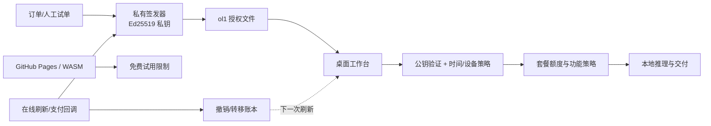

# ADR-0001：桌面离线授权采用 Ed25519 签名文件

- 状态：已接受（2026-09-16）
- 范围：Rembg Studio 桌面版、GitHub Pages/WASM 演示和后续支付适配器

## 背景

Rembg Studio 需要同时支持 GitHub Pages 的免费演示、Windows/macOS/Linux 桌面包，以及网络不稳定或完全离线的创作者工作流。现有 HMAC 令牌适合本机服务和手工试单，但验证端必须持有共享密钥；把这个密钥放进桌面包或浏览器后，任何拿到包的人都可以伪造付费令牌。GitHub Pages 是静态站点，不能承担私钥、订单回调或撤销账本。

商业授权还需要过期、机器转移和在线刷新/撤销这些能力。授权强度的目标是防止普通用户篡改权限和复制授权，而不是承诺不可破解；桌面二进制仍需要代码签名和后续的完整性加固。

## 备选方案

### A：继续把 HMAC 令牌扩展到桌面端

实现成本最低，也能复用当前 `commerce.py`。但是验证端需要共享密钥，密钥一旦进入 Nuitka 包就不再是秘密；撤销只能依赖额外的在线服务，离线校验无法区分复制出来的同一个令牌。这个方案只保留为当前私有手工试单的过渡层。

### B：采用供应商授权控制面（Keygen CE/Cloud 等）

订单、机器激活、撤销和客户管理可以交给成熟服务，减少自建账本和运维。代价是外部依赖、持续成本、服务可用性和供应商许可证边界；桌面端仍需要验证签名文件，不能只把管理员令牌塞进客户端。该方案适合作为后续发行/支付适配器，不作为第一步的运行时耦合。

### C：自有 Ed25519 离线签名文件 + 可替换发行适配器（选定）

私有签发器持有 Ed25519 私钥，桌面验证器只内置公钥；授权文件可以离线检查签名、套餐、有效期和可选的设备哈希。在线刷新后，服务端再维护撤销和转移记录。签名格式和发行接口保持独立，未来可把签发器替换成 Keygen 或自建支付服务，而无需改动桌面策略。

选 C 的原因是它先解决当前最危险的边界（客户端不能伪造付费授权），运行时依赖小、适合弱网/空网，并且不会阻塞尚未确定的收款主体和支付渠道。

## 决策

1. 新增 `rembg-offline-v1`/`ol1` 授权格式：规范化 claims 后用 Ed25519 签名，文件只包含公钥可验证的数据，不包含私钥。
2. claims 至少包含 `license_id`、`subject`、`plan_id`、`issued_at`、`expires_at`；`device_hash` 可选。套餐额度仍由客户端内置的安全目录决定，签名文件不能自带任意额度。
3. 验证器支持时间检查和可选设备哈希匹配。设备绑定失败、过期、签名或格式错误均 fail closed；换机通过发行新文件完成，撤销在下一次在线刷新/服务端检查时生效。
4. 当前 HMAC `v1` 令牌保持兼容，只用于本机服务和私有试单；不会把 `REMBG_LICENSE_SECRET` 打进安装包或 Pages。
5. Pages/WASM 继续免费，不存放私钥，也不在前端伪造付费状态。生产桌面发行时再通过构建配置嵌入公钥并对安装包做 Authenticode/平台代码签名。

## 结构

## 后续边界

- 现在只交付可测试的签名/验证层和手工发行命令，不宣称已经接入支付或完成撤销服务。
- 完成至少 3 次真实付费试单并冻结收款主体后，再选择 Keygen CE/Cloud、支付宝/微信或自建服务作为发行适配器。
- 年付企业客户或明确提出防篡改要求时，才评估 CodeMeter、硬件密钥或更重的反调试方案；它们会带来成本、兼容性和支持负担。
