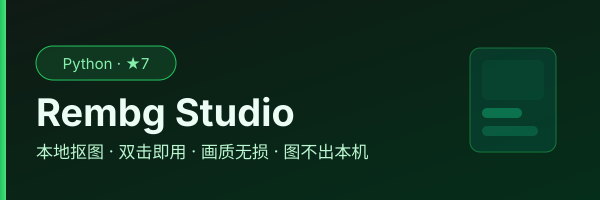

<div align="center">
  
</div>

# Rembg Studio

基于 AI 的图像背景去除 + 智能抠图工具。**纯后端架构**：FastAPI 只提供服务，UI 由浏览器加载，一套前端同时适配桌面与手机。

## 功能

### 商品图工作台（本地开发版）

批量添加照片 → 选择交付规格 → 开始处理 → 下载一个交付 ZIP。

- 800 / 1200 / 1600 / 2000 像素正方形画布，按透明主体边界居中，最小留白可选。
- 纯白、浅灰或透明背景；PNG / JPEG / WebP。透明背景不支持 JPEG。
- SKU 前缀加唯一序号命名；未填写前缀时保留原文件名主体。ZIP 支持中文名。
- 首次处理锁定整批规格和模型参数，暂停后从剩余图片继续，失败项可重试。
- 下载只包含已完成项；可逐图确认并选择仅导出已确认项。ZIP 附带 `delivery-manifest.json`，列出全部任务及导出状态。每批最多 50 张，每张最多 25 MB。
- 自动保存当前批次的原图、结果、复核状态和交付设置，刷新后可恢复，中断项回到待处理。请等待“批次已保存”后关闭页面。
- 保存范围是同一浏览器、同一访问地址（包含端口）；更换浏览器/地址、清除站点数据或浏览器回收存储后无法保证恢复。存储失败会提示，请下载结果留档。
- 多页面修改冲突时停止自动保存并提示，不覆盖另一页面的批次。清空队列会同时清空当前浏览器保存的批次。
- 关闭“统一商品图”可保留原尺寸透明 PNG。

首次模型下载需要网络；推理和商品图合成在本机执行。当前修图结果仍使用原有单图保存入口，尚未自动回写批量队列。

验证：`python -m unittest tests.test_product_export tests.test_product_zip -v`（ZIP / 工作流测试需要 Node.js）。

| 功能 | 说明 |
|------|------|
| **Rembg 去背景** | 一键去除图片背景，支持多种模型 |
| **SAM 智能抠图** | MobileSAM 点选分割，正点/负点精确控制 |
| **自动检测** | 一键识别图中所有物体，选中最需要的遮罩 |
| **剔除优化** | 结果图上直接点击多余区域，自动加负点重跑 |
| **裁剪旋转** | 预处理工具：拖拽裁剪、90° 旋转、任意角度 |
| **批量抠图** | 多图排队处理，一次下载全部结果 |
| **手机访问** | 同一 WiFi 扫码即用，触屏可直接框选/点选/涂画 |

## 架构

```
┌─────────────── 后端（FastAPI，仅提供服务）──────────────┐
│  rembg / MobileSAM 抠图 API       前端静态资源（单文件）│
└──────────────────────────┬───────────────────────────────┘
                           │  http://127.0.0.1:8042
        ┌──────────────────┼──────────────────┐
        ▼                  ▼                  ▼
   桌面浏览器          手机浏览器          远程设备
  （自动打开）      （同一 WiFi 扫码）   （tailscale/frp 等）
```

- **后端**：Python + FastAPI + Uvicorn，无任何原生窗口 / pywebview 依赖
- **前端**：单文件 HTML（原生 CSS/JS），移动端响应式 + 触屏交互
- 后端启动后自动打开本机浏览器；手机/远程设备通过浏览器访问

## 使用方式

### 从源码运行

```bash
# 需要 Python 3.10+，推荐用 uv
uv sync
uv run python main.py
```

启动后自动打开浏览器 `http://127.0.0.1:8042`。首次运行会自动下载模型，请保持网络连接。

### 手机 / 局域网访问

默认只监听 `127.0.0.1`（仅本机）。想让手机（iOS/Android）访问，二选一：

```bash
uv run python main.py --lan            # 一键开启局域网访问
# 或
REMBG_HOST=0.0.0.0 uv run python main.py
```

开启后：

1. 桌面浏览器里点左下角 **「📱 手机连接」**，会弹出二维码
2. 手机浏览器扫码，或直接输入二维码下方的地址（如 `http://192.168.1.23:8042`）
3. 手机端界面自动适配，SAM 框选 / 点选 / 画笔均支持触屏操作

> ⚠️ 监听 `0.0.0.0` 表示同一局域网内任何设备都能调用本工具，请仅在可信网络中使用。

### 公网访问（可选）

局域网之外（如出差时从手机连家里的电脑），需配合内网穿透，任选其一：

- **Tailscale**：两端装客户端，登录后手机浏览器访问 `http://<tailscale-ip>:8042`
- **frp / ngrok**：把本地 `8042` 端口暴露到公网域名，手机浏览器访问该域名

这些工具只做「隧道」，后端本身无需改动；建议绑定 `0.0.0.0` 后配合穿透使用。

### 直接下载

- **Windows**：从 [Releases](https://github.com/lilyco-42/rembg-ui/releases) 下载 `Rembg-UI-windows.zip`，解压运行 `rembg-ui.exe`
- **Linux**：下载 `Rembg-UI-linux.tar.gz`，解压后运行 `./rembg-ui.bin`
- **macOS**：下载 `Rembg-UI-macOS.dmg`（或 `.app` 压缩包），拖入「应用程序」运行

> macOS 未签名应用首次打开如提示「无法验证开发者」，右键 → 打开 即可；或用 `xattr -dr com.apple.quarantine "Rembg Studio.app"` 解除隔离。

## 商业试用状态

浏览器版是免费的本地处理演示；当前建议用创作者版 ¥29/月、小团队版 ¥99/月做第一轮支付意愿实验，价格仍标记为实验假设。Rembg Studio 购买页使用积分兑换（创作者版 420 分、小团队版 1450 分；1 USDT = 100 分），USDT 只用于充值积分。桌面端已包含套餐目录、有效期、HMAC 手工试单和 Ed25519 离线授权验证核心；lain42.top 已部署 USDT/TRC20 充值积分、Rembg 积分兑换、`ol1` 自动签发和独立积分账本接口。没有授权令牌时始终回落到受限试用。支付宝/微信/Stripe、正式商家主体、退款回调、自动撤销与换机流程尚未冻结，不能把 GitHub Pages 的前端状态当作商业授权。

商业放行需要先完成有授权商品样本、目标设备压力测试和真实付费试单，记录直接交付率、返修/支持时间、退款与实际成本。详见 [商业模型](docs/commercial-model.md)、[商业化进度](docs/commercial-progress.md) 和 [仓库商业评估](docs/repo-roi-2026-09-16.md)。

## 工作流

### 一键去背景

```
拖入图片 → 选择模型 → 点击「开始抠图」→ 保存
```

### SAM 精准抠图（抠衣服、物体）

```
① 拖入图片 → 切换到「SAM 抠图」模式
② 点「载入到 SAM」
③ 选工具：▭ 框选 / ✏ 画笔 / ◉ 点选
④ 应用 → 浏览候选遮罩，选中结果
⑤ 结果图上点多余区域自动剔除
⑥ 满意后保存
```

> 桌面端：框选用**右键拖拽**；移动端：直接用手指在图上框选 / 涂画 / 点选。双击可缩放，缩放后可单指拖动平移。

### 先裁剪再处理

```
拖入图片 → 工具栏点「裁剪」→ 拖拽选区 → Enter 确认 → 再执行去背景或 SAM 抠图
```

## SAM 模式说明

SAM（Segment Anything Model）是 Meta 开源的分割模型，本工具使用 **MobileSAM** 轻量版本，CPU 即可运行。

- 首次使用自动下载模型 `mobile_sam.pt`（~40MB）
- 支持正点（前景）和负点（背景）组合
- 自动检测模式下最多输出 26 个候选遮罩
- 结果图点击自动转换为负点，即时优化

## 技术栈

- **后端**: Python + FastAPI + Uvicorn
- **前端**: 原生 HTML/CSS/JS（无框架依赖，响应式 + 触屏）
- **去背景**: rembg (BRIA-RMBG / BiRefNet / U²-Net)
- **分割**: MobileSAM (via ultralytics)
- **打包**: Nuitka（Windows / Linux / macOS）、原生 Android（ABI 拆包）、WASM/PWA

## 打包与多平台发行

桌面端由 `build_nuitka.py` 按系统生成对应应用格式（Windows `rembg-ui.exe` / Linux `rembg-ui.bin` / macOS `rembg-ui.app` 并附带 `.dmg`）。Android 使用独立原生端侧实现，按 ABI 拆分 APK 并同时生成 AAB；浏览器版构建为可安装的 WASM PWA。

```powershell
# Windows - Nuitka（产物 dist/rembg-ui.dist/rembg-ui.exe）
.\nuitka.ps1
# Windows - PyInstaller（备用）
.\pyinstaller.ps1
```

```bash
# Linux - Nuitka（产物 dist/Rembg-UI-linux.tar.gz）
./build_nuitka_linux.sh
```

```bash
# macOS - Nuitka（产物 dist/rembg-ui.app + dist/Rembg Studio.dmg，需在 macOS 上执行）
uv run python build_nuitka.py release
```

```powershell
# Android - ABI 拆分 APK + AAB（JDK 17、Android SDK 35）
cd android
./gradlew.bat :app:assembleRelease :app:bundleRelease
```

CI 会在同一版本 tag 下构建 Windows / Linux / macOS / Android 产物并发布到同一 Release；WASM PWA 由 `web` workflow 构建，Pages 站点同步 `web/dist`（见 `.github/workflows/build.yml`、`.github/workflows/web.yml`）。Android 的签名密钥只从 Actions secrets 注入，未配置时会明确产出 unsigned 包，详见 [`android/README.md`](android/README.md)。完整边界见 [`docs/platform-matrix.md`](docs/platform-matrix.md)。

## 项目结构

```
rembg-ui/
├── main.py                  # 应用入口 + API 路由（启动、浏览器、模型、抠图、SAM、网络）
├── sponsor/                 # 赞助与教程模块（FastAPI Router + 前端注入）
├── processors/              # 处理器模块
│   ├── sam_processor.py     # MobileSAM 分割
│   ├── fastsam.py           # FastSAM（备用）
│   └── cloth_seg.py         # 服装解析（备用）
├── frontend/                # 前端静态资源
│   └── index.html           # 单文件 UI（响应式 + 触屏 + 内嵌离线二维码）
├── build_nuitka.py          # Nuitka 跨平台构建脚本（按平台生成参数）
├── build_nuitka_linux.sh    # Linux Nuitka 打包 + 压缩
├── nuitka.ps1               # Windows Nuitka 打包脚本
├── pyinstaller.ps1          # Windows PyInstaller 打包脚本
├── android/                 # 原生 Android 端（ONNX Runtime，ABI 拆包）
├── web/                     # WASM/PWA 浏览器端
└── pyproject.toml           # 项目配置（uv）
```
